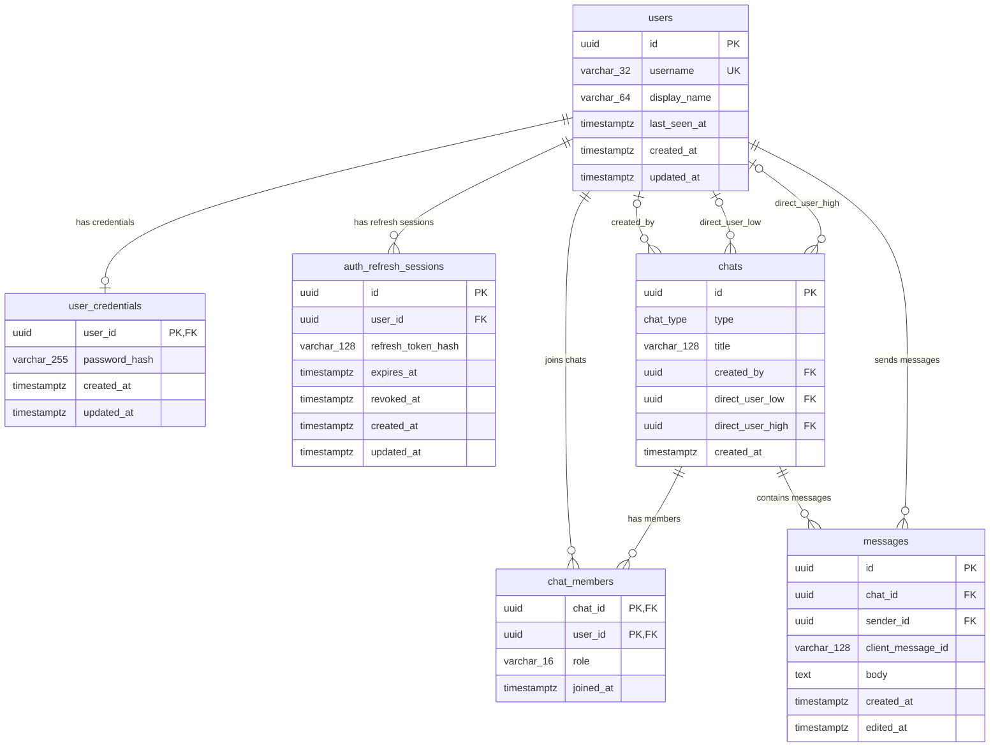

# Диаграмма связей базы данных TheChat

Эта диаграмма отражает текущую Drizzle-схему и SQL-миграции до
`src/db/migrations/0006_direct_chat_invariants.sql` включительно.

## Визуальный обзор

Основной обзор ниже использует обычный ASCII-текст, совместимый с Markdown.
Кардинальность показана как `parent -> child`; delete action описывает поведение
дочернего foreign key при удалении родительской строки.

```text
                                      ┌────────────────────────────┐
                                      │ users                      │
                                      │ PK id                      │
                                      │ UK username                │
                                      │ display_name               │
                                      │ last_seen_at               │
                                      └─────────────┬──────────────┘
                                                    │
          ┌─────────────────────────────────────────┼─────────────────────────────────────────┐
          │                                         │                                         │
          ▼ 1 -> 0..1, CASCADE                      ▼ 1 -> 0..N, CASCADE                     ▼ 1 -> 0..N, SET NULL/RESTRICT
┌────────────────────────────┐         ┌────────────────────────────┐          ┌────────────────────────────┐
│ user_credentials           │         │ auth_refresh_sessions      │          │ chats                      │
│ PK/FK user_id              │         │ PK id                      │          │ PK id                      │
│ password_hash              │         │ FK user_id                 │          │ type: direct | group       │
└────────────────────────────┘         │ refresh_token_hash         │          │ title                      │
                                       │ expires_at, revoked_at     │          │ FK created_by (SET NULL)   │
                                       └────────────────────────────┘          │ FK direct_user_low         │
                                                                               │ FK direct_user_high        │
                                                                               │ direct pair: RESTRICT      │
                                                                               └─────────────┬──────────────┘
                                                                                             │
                                           ┌─────────────────────────────────────────────────┴─────────────────────────────────────────────────┐
                                           │                                                                                                   │
                                           ▼ 1 -> 0..N, CASCADE                                                                                ▼ 1 -> 0..N, CASCADE
                              ┌────────────────────────────┐                                                                    ┌────────────────────────────┐
                              │ chat_members               │                                                                    │ messages                   │
                              │ PK/FK chat_id              │                                                                    │ PK id                      │
                              │ PK/FK user_id              │                                                                    │ FK chat_id                 │
                              │ role                       │                                                                    │ FK sender_id (RESTRICT)    │
                              └─────────────┬──────────────┘                                                                    │ client_message_id          │
                                            │                                                                                   │ body, created_at           │
                                            │ 0..N -> 1, CASCADE                                                                └─────────────┬──────────────┘
                                            └──────────────────────────────────────────────► users.id ◄────────────────────────────────────────┘ 0..N -> 1, RESTRICT
```

## ERD для машинного рендера



## Примечания по связям

- `user_credentials.user_id` одновременно является primary key и foreign key на
  `users.id`; при удалении пользователя credentials удаляются каскадно.
- `auth_refresh_sessions.user_id` ссылается на `users.id` с cascade delete.
- `chat_members` использует composite primary key `(chat_id, user_id)` и связывает
  users с chats; оба foreign keys удаляются каскадно.
- `messages.chat_id` ссылается на `chats.id` с cascade delete.
- `messages.sender_id` ссылается на `users.id` с restrict delete, сохраняя
  целостность авторства сообщений.
- `chats.created_by` ссылается на `users.id` с delete behavior `SET NULL`.
- `chats.direct_user_low` и `chats.direct_user_high` ссылаются на `users.id`
  с restrict delete и моделируют нормализованную пару пользователей для direct chats.

## Важные ограничения

- `chats_direct_pair_unique_idx` гарантирует один direct chat на нормализованную
  пару пользователей, когда `chats.type = 'direct'`.
- `chats_direct_pair_shape_check` требует, чтобы direct chats имели двух разных
  direct users, а group chats не имели direct user pair.
- `messages_idempotency_unique_idx` гарантирует идемпотентность сообщений для
  `(chat_id, sender_id, client_message_id)`, когда `client_message_id` не равен
  `null`.
