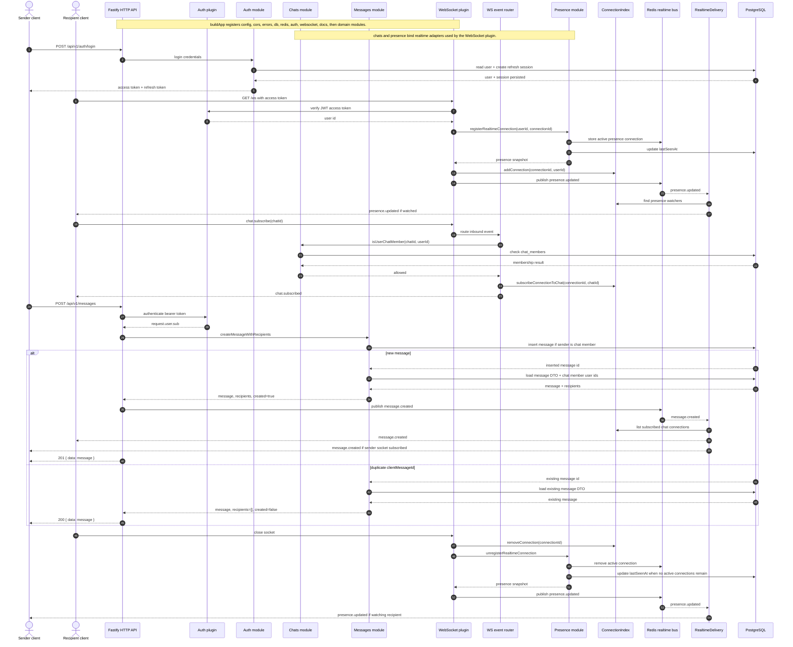

# Диаграмма последовательности backend TheChat

```mermaid
sequenceDiagram
    autonumber
    actor Sender as Sender client
    actor Recipient as Recipient client
    participant API as Fastify HTTP API
    participant Auth as Auth plugin
    participant AuthMod as Auth module
    participant Chats as Chats module
    participant Messages as Messages module
    participant WS as WebSocket plugin
    participant Router as WS event router
    participant Presence as Presence module
    participant Index as ConnectionIndex
    participant Redis as Redis realtime bus
    participant Delivery as RealtimeDelivery
    participant DB as PostgreSQL

    Note over API,WS: buildApp registers config, cors, errors, db, redis, auth, websocket, docs, then domain modules.
    Note over Chats,Presence: chats and presence bind realtime adapters used by the WebSocket plugin.

    Sender->>API: POST /api/v1/auth/login
    API->>AuthMod: login credentials
    AuthMod->>DB: read user + create refresh session
    DB-->>AuthMod: user + session persisted
    AuthMod-->>Sender: access token + refresh token

    Recipient->>WS: GET /ws with access token
    WS->>Auth: verify JWT access token
    Auth-->>WS: user id
    WS->>Presence: registerRealtimeConnection(userId, connectionId)
    Presence->>Redis: store active presence connection
    Presence->>DB: update lastSeenAt
    Presence-->>WS: presence snapshot
    WS->>Index: addConnection(connectionId, userId)
    WS->>Redis: publish presence.updated
    Redis-->>Delivery: presence.updated
    Delivery->>Index: find presence watchers
    Delivery-->>Recipient: presence.updated if watched

    Recipient->>WS: chat.subscribe(chatId)
    WS->>Router: route inbound event
    Router->>Chats: isUserChatMember(chatId, userId)
    Chats->>DB: check chat_members
    DB-->>Chats: membership result
    Chats-->>Router: allowed
    Router->>Index: subscribeConnectionToChat(connectionId, chatId)
    Router-->>Recipient: chat.subscribed

    Sender->>API: POST /api/v1/messages
    API->>Auth: authenticate bearer token
    Auth-->>API: request.user.sub
    API->>Messages: createMessageWithRecipients
    Messages->>DB: insert message if sender is chat member
    alt new message
        DB-->>Messages: inserted message id
        Messages->>DB: load message DTO + chat member user ids
        DB-->>Messages: message + recipients
        Messages-->>API: message, recipients, created=true
        API->>Redis: publish message.created
        Redis-->>Delivery: message.created
        Delivery->>Index: list subscribed chat connections
        Delivery-->>Recipient: message.created
        Delivery-->>Sender: message.created if sender socket subscribed
        API-->>Sender: 201 { data: message }
    else duplicate clientMessageId
        DB-->>Messages: existing message id
        Messages->>DB: load existing message DTO
        DB-->>Messages: existing message
        Messages-->>API: message, recipients=[], created=false
        API-->>Sender: 200 { data: message }
    end

    Recipient->>WS: close socket
    WS->>Index: removeConnection(connectionId)
    WS->>Presence: unregisterRealtimeConnection
    Presence->>Redis: remove active connection
    Presence->>DB: update lastSeenAt when no active connections remain
    Presence-->>WS: presence snapshot
    WS->>Redis: publish presence.updated
    Redis-->>Delivery: presence.updated
    Delivery-->>Sender: presence.updated if watching recipient
```
